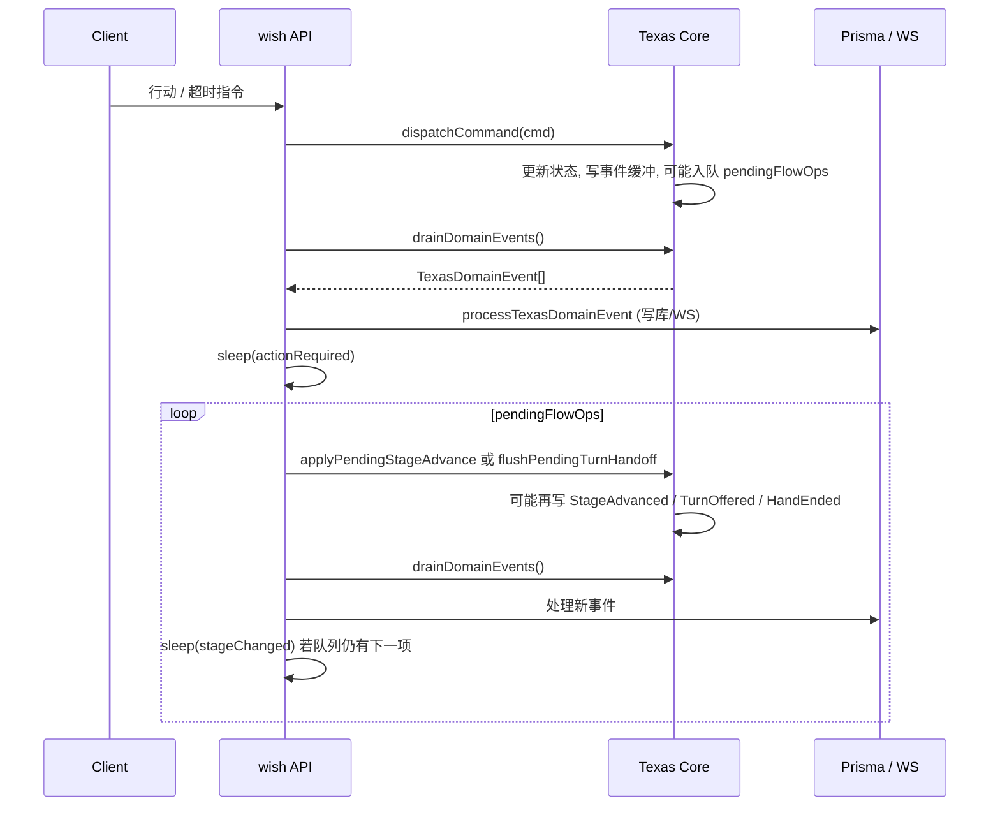

# Core 与 wish 集成：一整局领域事件流

本文描述 **texas-poker-core**（规则与状态机）与 **wish_mono_server / apps/texas**（持久化、WS、节拍）如何协作，走完从进桌到局间倒计时的一整局事件流。实现以当前代码为准，路径相对于各仓库根目录。

---

## 1. 职责划分

| 层级     | 职责                                                                                                          | 不做的事                                             |
| -------- | ------------------------------------------------------------------------------------------------------------- | ---------------------------------------------------- |
| **Core** | 校验合法性、更新内存状态、向缓冲写入 **领域事件**；进街与交权通过 **`pendingFlowOps` 队列**延后到业务显式消费 | 无 DB、无 WS、无 `sleep`、不直接推送客户端           |
| **wish** | `drainDomainEvents` → 解释每条事件：写 Prisma、发 WS、按配置 **sleep** 再消费 `pendingFlowOps`                | 不篡改 Core 规则；超时由 wish 调度 `dispatchCommand` |

Core 提供的统一行动入口为 **`Texas#dispatchCommand(TableCommand)`**；事件取出为 **`Texas#drainDomainEvents()`**（合并会话级与本手级缓冲）。

---

## 2. 领域事件两类来源

1. **会话级**（`SessionDomainEvent`）：`RolesAssigned`、`HoleCardsDealt` — 由 `Texas#setPlayerRoles`、`Texas#dealCards` 写入 `#sessionEvents`。
2. **本手级**（`HandDomainEvent`）：`HandStarted`、`BlindsPosted`、`PlayerActed`、`PotUpdated`、`StageAdvanced`、`TurnOffered`、`TurnEnded`、`PotAwarded`、`HandEnded` — 由 `Controller` / `Player` 路径写入，经 `drainHandEvents()` 与 session 事件一并 `drain`。

每条本手事件带 **`handId`**（`start()` 时形如 `h1`）与单调 **`seq`**，供 wish 侧 **(matchId, domainHandId, domainEventSeq)** 幂等落库。

完整类型见：`src/domain/handDomainEvents.ts`。

---

## 3. 一整局时间线（wish 视角）

### 3.1 首局开局（`useCase` 主流程 + `eventBinder` 局间钩子）

首局在房间进入游戏后，大致顺序为：

1. 延迟（`startGameBeforeAssignRolesDelayMs`）→ `texas.setPlayerRoles()` → **`drainAndInterpretTexas`**
   - 事件：`RolesAssigned` → DB upsert 角色、WS `roles-assigned`。
2. 延迟（`nextHandDealAfterEndMs`）→ `texas.dealCards()` → **`drainAndInterpretTexas`**
   - 事件：`HoleCardsDealt` → 更新 `playerMatchRecord.handPokes`、私聊 WS 发手牌。
3. 延迟（`nextHandStartAfterDealMs`）→ `texas.start()` → **`drainAndInterpretTexas`**
   - Core：`HandStarted`、`BlindsPosted`、`PotUpdated`；`pendingFlowOps` 入队首位 **`turn_handoff`**（首人思考权尚未 `getControl`）。
   - wish：先 drain 上述事件；再 **`drainPendingFlowQueueWithPacing`**（见 §5）→ 首条 `TurnOffered`、调度思考超时等。

**后续局**（局间倒计时结束）由 `eventBinder` 注册 `registerNextHandHooks`：`onAssignRoles` / `onDeal` / `onStart` 内同样在每个 Core 步骤后调用 **`drainAndInterpretTexas`**。

### 3.2 局中每次玩家行动（HTTP / 超时调度）

1. wish 调用 **`texas.dispatchCommand(cmd)`**（如 `Fold`、`Call`、`CheckDueToTimeout` 等）。
2. Core 完成本步下注逻辑后，可能立刻往缓冲写入 **`PlayerActed`、`TurnEnded`、`PotUpdated`** 等；并在需要时向 **`pendingFlowOps`** 追加 **`stage_advance`** 或 **`turn_handoff`**。
3. wish 调用 **`drainAndInterpretTexas(ctx)`**：
   - 先 **`drainBufferedDomainEvents`**：处理本批领域事件（下注流水、阶段时间轴、`action-taken`、`player-action-required` 等）。
   - 再 **`drainPendingFlowQueueWithPacing`**：按节拍 `applyPendingStageAdvance` / `flushPendingTurnHandoff` 并再次 drain 新生成事件。

典型调用点：`takeActionUseCase`、`router/action`、`playerTurnTimeoutScheduler`（动态 import `drainTexasDomainEvents`）。

### 3.3 本手结束（`HandEnded`）

- Core 在 **独赢弃牌**或 **摊牌结算路径**上推送 **`HandEnded`**（payload 含 `outcome`、`pokesRevealed`、`currentStage`、`endStage` 等）。
- wish 在 **`processTexasDomainEvent` → `handleHandEnded`** 中：
  - `texas.settle()`、必要时 **`flushEventsAfterSettle`** 消费嵌套的 `PotAwarded` 等；
  - 更新 `match` / `playerMatchRecord`；
  - **showdown** 时在落库与组好 overview 之后 **`sleep(stageChangedDelayMs)`**，再 **`notifyGameEndPerViewer`**（仅推送节奏延迟，规则状态已在 Core 内结束）；
  - `controller` 进入 `between_hands`（复盘窗口）；随后业务 **`texas.reset()`** 将控制器回 `idle` 并 **`room.unlockSeats()`**；触发局间倒计时等。

---

## 4. `pendingFlowOps` 与 Core 行为（固定语义）

Core **不再**在 `transferControlTo` 里直接 `getControl()`：只设置 `activePlayer` 并入队 **`turn_handoff`**。  
下注轮结束需进街时，不入队立即进街，而是入队 **`stage_advance`**（含正常进街与 **跑马** 多段，每段一项）。

业务（wish）必须周期性调用：

- **`texas.applyPendingStageAdvance()`** — 消费队头 `stage_advance`，可能产生 **`StageAdvanced`**，摊牌最后一跳后可能直接产生 **`HandEnded`**。
- **`texas.flushPendingTurnHandoff()`** — 消费队头 `turn_handoff`，触发 **`getControl()`** 与缓冲中的 **`TurnOffered`**。

单测/脚本无节拍时可 **`texas.flushAllPendingFlowOps()`**（内部 `drainPendingFlowOpsSync`）一次排空。

---

## 5. wish：`drainAndInterpretTexas` 算法概要

对应文件：`wish_mono_server/apps/texas/src/router/game/services/texasDomain/drainTexasDomainEvents.ts`。

```
drainAndInterpretTexas(ctx):
  drainBufferedDomainEvents(ctx)          // 循环 texas.drainDomainEvents() 直到空，逐条 processTexasDomainEvent
  drainPendingFlowQueueWithPacing(ctx)    // 若 getPendingFlowOps().length > 0：
    sleep(actionRequiredWsDelayMs)      // 默认 2000ms，来自 gameRuntimeConfig
    while 队列非空:
      if 队头 == stage_advance:
           texas.applyPendingStageAdvance()
           drainBufferedDomainEvents(ctx)
           if 队列仍非空: sleep(stageChangedWsDelayMs)   // 默认 3000ms
      else:  // turn_handoff
           texas.flushPendingTurnHandoff()
           drainBufferedDomainEvents(ctx)
```

**说明**：`game-stage-changed` WS 在 **`StageAdvanced`** 的处理函数里**立即**发送；上述 `stageChangedWsDelayMs` 用于 **下一段队列操作之前**的停顿，以及 showdown 后 **`game-end` 前的停顿**（与 `constants/game.ts` / `gameRuntimeConfig` 注释一致）。

---

## 6. wish 对主要事件的处理摘要

| 事件                                                       | 主要副作用                                                                                         |
| ---------------------------------------------------------- | -------------------------------------------------------------------------------------------------- |
| `RolesAssigned`                                            | `match.startedAt`、Prisma `playerMatchRecord` upsert、WS                                           |
| `HoleCardsDealt`                                           | 更新各玩家 `handPokes`、按用户私发 WS                                                              |
| `HandStarted`                                              | `matchStageTimeRecord`、WS `game-start`                                                            |
| `BlindsPosted` / `PotUpdated` / `TurnEnded` / `PotAwarded` | 当前多为 no-op 或已由其它事件覆盖；`PotAwarded` 可在 settle 后嵌套 drain 中处理                    |
| `PlayerActed`                                              | `betRecord` 幂等写入、`notifyActionTaken`、清除本房间思考超时                                      |
| `StageAdvanced`                                            | 阶段时间记录、`notifyStageChanged`（立即）                                                         |
| `TurnOffered`                                              | 注册思考超时、`notifyActionRequired`（含 `deadlineAt`）                                            |
| `HandEnded`                                                | settle、DB 结算字段、`notifyGameEndPerViewer`（showdown 带延迟）、`controller.reset()`、局间倒计时 |

---

## 7. 超时与 `TurnEnded.reason`

- wish 在收到 **`TurnOffered`** 后为当前行动方注册截止时间；到期后下发 **`FoldDueToTimeout`** 或 **`CheckDueToTimeout`**。
- Core 在对应路径上 **`setPendingTurnEndedReason('timeout')`**，随后 **`TurnEnded`** 的 payload 中 **`reason: 'timeout'`**。

---

## 8. Core 包内可选编排雏形（wish 未强制使用）

`src/orchestration/interpret.ts` 提供通用 **`interpret(events, ctx, handlers)`**。  
**wish 当前未使用该管道**，而是使用自定义的 **`processTexasDomainEvent` + `drainAndInterpretTexas`**；二者在「按事件类型分支做副作用」上是同一类模式。

---

## 9. 关键文件索引

**Core（本仓库）**

- `src/Texas/index.ts` — `dispatchCommand`、`drainDomainEvents`、`applyPendingStageAdvance`、`flushPendingTurnHandoff`、`flushAllPendingFlowOps`
- `src/Controller/index.ts` — 事件写入、`pendingFlowOps`、进街与摊牌跑马队列
- `src/domain/handDomainEvents.ts` — 事件类型定义
- `src/domain/tableCommand.ts` — `TableCommand` ADT
- `CORE_API.md` — 对外 API 摘要

**wish（参考实现）**

- `apps/texas/src/router/game/services/eventBinder.ts` — 绑定局间钩子与 `drainAndInterpretTexas`
- `apps/texas/src/router/game/services/texasDomain/drainTexasDomainEvents.ts` — 事件解释 + 节拍队列
- `apps/texas/src/router/game/services/useCase.ts` — 首局 `setPlayerRoles` / `dealCards` / `start` 与 drain 顺序
- `apps/texas/src/router/game/services/takeActionUseCase.ts`、`apps/texas/src/router/action/index.ts` — 玩家行动后 drain
- `apps/texas/src/router/game/services/texasDomain/playerTurnTimeoutScheduler.ts` — 超时后 dispatch + drain
- `apps/texas/src/utils/gameRuntimeConfig.ts` — 节拍毫秒数运行时配置

---

## 10. 图示：行动后数据流



---

_文档版本：与 `pendingFlowOps` 固定行为及已移除 `TexasEngineContext.deferTurnHandoffUntilFlushed` / `businessPacedHandFlow` 后的实现对齐。_

**API 与不变量速查**：[refactor-maintainer-reference.md](./refactor-maintainer-reference.md)。
