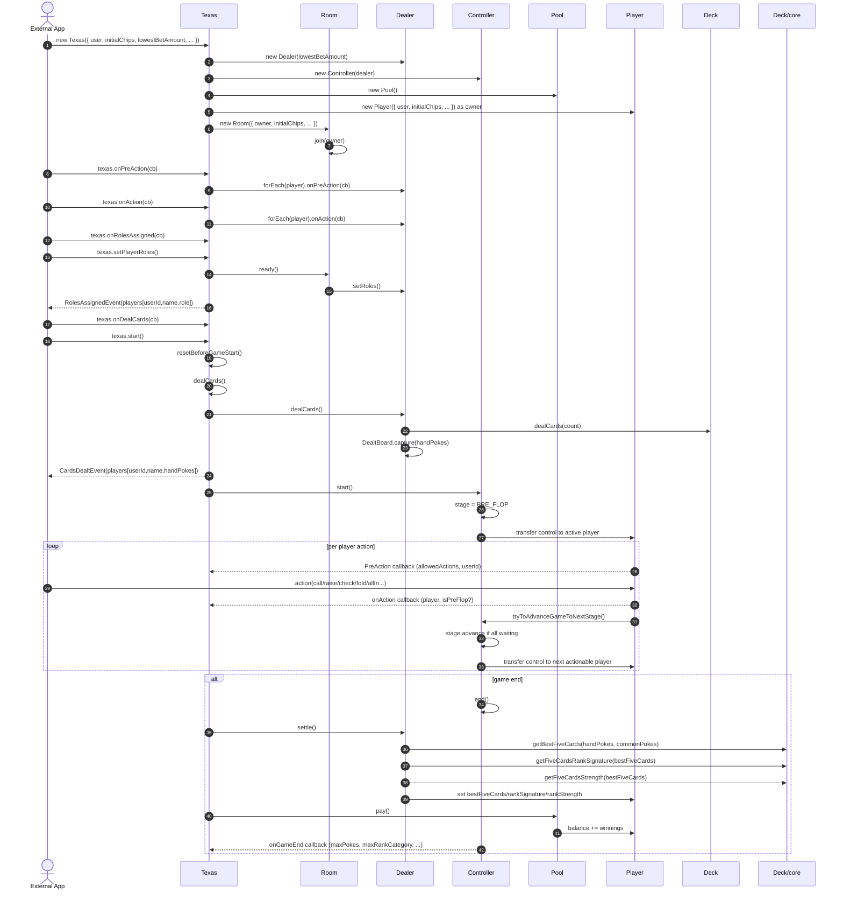

## Overview

该项目以 `Texas` 为对外门面，内部由 `Room / Dealer / Controller / Pool / Deck` 等组件协作完成一局德州的完整生命周期。

核心思想：

- **Room** 管“人”和“座位/观战”以及默认起始筹码 `initialChips`
- **Dealer** 管“玩家环形链表 + 位置(role) + 发牌 + 结算前计算（bestFiveCards / rankSignature / rankStrength）”
- **Controller** 管“阶段(stage)推进 + 行动权(activePlayer) + 游戏结束条件”
- **Pool** 管“下注记录/边池/派奖”
- **Deck/core** 管“五张组合牌型评估与比较（RankSignature/RankCategory/Strength）”

---

## Main lifecycle (sequence)

下面的时序图刻意包含 **PreAction** 与 **onAction** 两条回调链路，便于对齐前端交互。

---

## State machines

### Controller

- `HandLifecycle`: `idle` → `in_hand` → `hand_complete`（可选：`in_hand_paused`，预留：`aborted`）
- `StageEnum`: `PRE_FLOP` → `FLOP` → `TURN` → `RIVER`

关键点：

- `activePlayer` 只由 `Controller.transferControlTo()` 维护
- 阶段推进由 `tryToAdvanceGameToNextStage()` 驱动（通常在每次行动后触发）

### Room

- `RoomStatus`: `seats_open` → `seats_locked`（`ready()` 后锁座/锁定角色）
- 坐席状态：
  - `on-set`：入座玩家（参与本局）
  - `hang`：观战玩家（不参与本局）

---

## Invariants (must always hold)

- 结算/比较前，每个未出局玩家必须满足：
  - `bestFiveCards` 已计算
  - `rankSignature` 已计算
  - `rankStrength` 已计算（用于排序/DB）
- `rankStrength` 的排序与 `compareRankSignature` 一致（强者数值更大）
- `rankSignature[0]` 必须是合法 `RankCategory`
- `RoleEnum` 分配必须与玩家数匹配（2~10 人桌）

---

## Error handling

- 统一使用 `TexasError`
- **fail-fast**：各组件通过注入的 `fail(error): never` 统一中断流程；`Texas.fail` 会先触发 `texas.onError(cb)` 的观察者回调，再 `throw`
- **domain guards**：推荐使用 `invariant/required` 进行业务约束校验，语义为“不满足即 fail”
- 回调/异步链路（HTTP/WebSocket/setTimeout 等）仍应在入口处捕获异常并转为对外响应；`onError` 更适合作为日志/监控/观测通道
